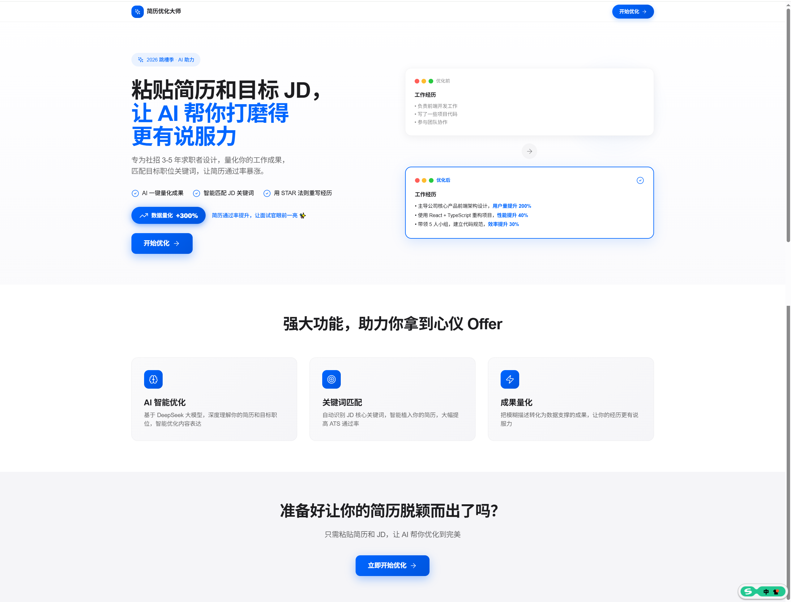
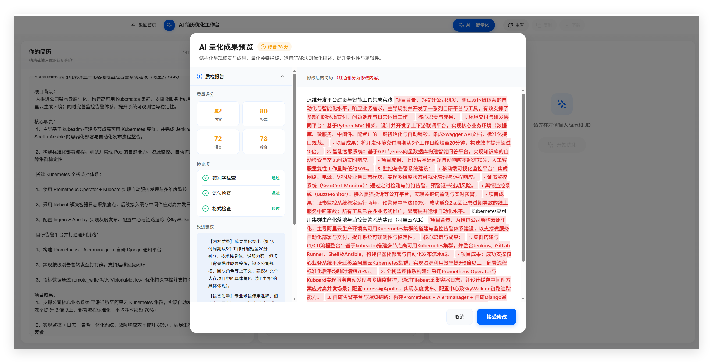
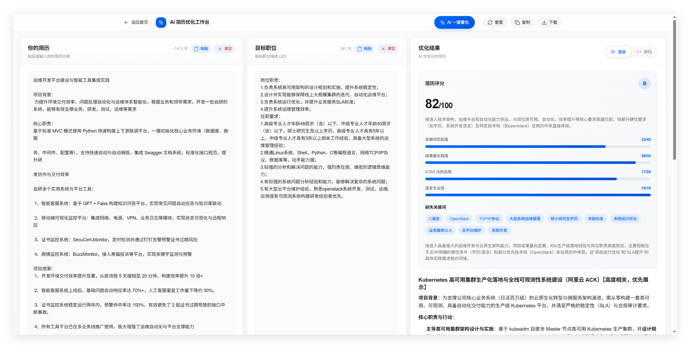

# AI 简历优化 SaaS (Boss_JD)

一个精致的 AI 简历优化应用，使用 Next.js 14 + Apple风格设计 + 硅基流动 API 构建，专为**社招 3-5 年**跳槽求职者打造。

## ✨ 功能特性

- 🤖 **AI 一键量化成果** - 将模糊描述转化为专业、量化的职场表达，适度优化内容
- 📊 **智能评分系统** - 4维度真实评分（关键词40分、量化30分、STAR20分、专业性10分）
- ✨ **简历整体优化** - 根据 JD 智能优化简历，分两步（先分析后流式输出）
- 🎯 **关键词匹配** - 智能识别缺失关键词
- 💾 **本地存储** - 无数据库，纯前端 MVP
- 🎨 **Apple 风格设计** - 精致的三栏布局，流畅的交互动效
- 📱 **响应式布局** - 35-25-40 黄金比例：简历输入、JD输入、结果展示


 

    

## 🛠️ 技术栈

- **框架**: Next.js 14 (App Router)
- **UI**: Tailwind CSS + 自定义 Apple风格组件
- **AI SDK**: 硅基流动 (SiliconFlow)
- **模型**: deepseek-ai/DeepSeek-V2.5
- **语言**: TypeScript

## 🎨 设计特点

- **Apple风格界面** - 简洁、精致、专业
- **玻璃效果导航** - 半透明 + 模糊效果
- **胶囊按钮** - 980px 圆角的标志性设计
- **渐变与阴影** - 柔和的视觉层次
- **SF Pro 字体风格** - 精准的字间距和行高

## 🚀 快速开始

### 1. 安装依赖

```bash
npm install
```

### 2. 配置环境变量

复制 `.env.local.example` 为 `.env.local`，然后填入你的硅基流动 API Key：

```env
SILICONFLOW_API_KEY=your_api_key_here
SILICONFLOW_BASE_URL=https://api.siliconflow.cn
SILICONFLOW_MODEL=deepseek-ai/DeepSeek-V2.5
```

在 https://cloud.siliconflow.cn 获取 API Key。

### 3. 启动开发服务器

```bash
npm run dev
```

访问 http://localhost:3000 查看应用。

## 📁 项目结构

```
ResumeAI/
├── app/
│   ├── page.tsx                    # 首页
│   ├── layout.tsx                  # 根布局
│   ├── globals.css                 # 全局样式
│   ├── dashboard/
│   │   └── page.tsx               # 工作台（三栏布局：35-25-40）
│   └── api/
│       ├── quantify/route.ts       # 量化成果接口（含质量检查）
│       ├── analyze/route.ts        # 简历分析接口（评分、关键词）
│       └── optimize/route.ts       # 简历优化接口（流式输出）
├── components/
│   ├── ResumeInput.tsx             # 简历输入组件
│   ├── JDInput.tsx                 # JD 输入组件
│   ├── ResultDisplay.tsx           # 结果展示组件
│   ├── ScoreCard.tsx               # 评分卡组件
│   └── QuantifyDialog.tsx          # 量化确认弹窗
├── lib/
│   └── siliconflow.ts              # AI 配置
├── design.md                       # Apple 风格设计指南
├── package.json
└── tsconfig.json
```

## 👥 目标用户

本产品专为**社招 3-5 年**想跳槽的求职者设计，帮助他们：
- 量化工作成果，让简历更有说服力
- 匹配目标职位关键词，通过 ATS 筛选
- 用 STAR 法则优化经历，提升面试通过率
- 优化简历表达，更专业职场

## 📖 使用说明

1. 访问首页，点击"开始优化"进入工作台
2. 在左侧（35%）粘贴你的简历，可一键粘贴或清空
3. （可选）点击"AI 一键量化成果"先优化简历，查看修改后确认接受
4. 在中间（25%）粘贴目标职位 JD，可一键粘贴或清空
5. 点击"开始优化"按钮
6. 右侧（40%）先展示评分和分析，再流式输出优化后的简历
7. 查看评分和优化结果，支持渲染视图/源码视图切换
8. 点击"复制"复制优化后的简历，或"下载"保存为 Markdown 文件

## 📊 评分标准

| 维度 | 分值 | 说明 |
|------|------|------|
| 关键词匹配度 | 40 | 是否覆盖 JD 核心关键词 |
| 成果量化程度 | 30 | 经历是否有具体数字支撑 |
| STAR 法则运用 | 20 | 经历是否清晰完整 |
| 语言专业性 | 10 | 表达是否专业职场 |

等级划分：
- A: 85-100
- B: 70-84
- C: 50-69
- D: 0-49

## 🎯 核心优化逻辑

### AI 一键量化成果
- 优化：量化成果、专业表达、STAR结构
- 检查：错别字、语法、格式、质量评分
- 展示：原文 + 修改处高亮 + 修改摘要

### 简历优化流程
1. 分析简历与 JD 匹配度
2. 生成评分与缺失关键词
3. 流式输出优化后的简历
4. 相关度优先的内容排序

## 📈 开发阶段

✅ **Phase 1**: Prompt 工程实战 - 设计高质量优化Prompt
✅ **Phase 2**: 项目初始化与 UI 搭建 - 三栏布局（35-25-40）
✅ **Phase 3**: AI API 集成（硅基流动）- 三个API接口：quantify、analyze、optimize
✅ **Phase 4**: 产品体验优化 - 优化量化逻辑、修复评分固定问题、质量检查
✅ **Phase 5**: Apple 风格设计重构 - 精致的视觉与交互体验
⏳ **Phase 6**: 部署与迭代
⏳ **Phase 7**: 产品化增强

## 📝 最近更新

- 2026-04-22: Apple 风格界面重构，优化按钮布局
- 2026-04-21: 增加质量检查功能，修复编译错误
- 2026-04-21: Prompt 优化，简历内容更详略得当
- 2026-04-20: 初始版本发布

## 📄 许可证

MIT
